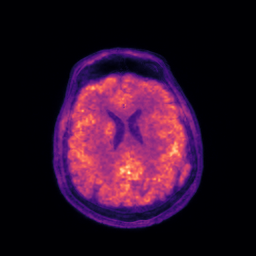
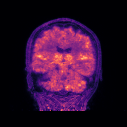

===========================================================
NiftyPET: High-throughput image reconstruction and analysis
===========================================================

.. image:: https://readthedocs.org/projects/niftypet/badge/?version=latest
  :target: https://niftypet.readthedocs.io/en/latest/?badge=latest
  :alt: Documentation Status
  
**Documentation**: https://niftypet.readthedocs.io/

*NiftyPET* is a software platform and a Python namespace package (encompassing sub-packages), offering high-throughput PET image reconstruction with high quantitative accuracy and precision as well as image manipulation, processing and analysis for PET/MR imaging.  The core routines are written in CUDA C and embedded in Python C extensions.

*NiftyPET* includes two packages:

  * ``nimpa``:  https://github.com/pjmark/NIMPA
  * ``nipet``:  https://github.com/pjmark/NIPET

The scientific aspects of this software platform are covered in two open-access publications:

* *NiftyPET: a High-throughput Software Platform for High Quantitative Accuracy and Precision PET Imaging and Analysis* Neuroinformatics (2018) 16:95. https://doi.org/10.1007/s12021-017-9352-y

* *Rapid processing of PET list-mode data for efficient uncertainty estimation and data analysis* Physics in Medicine & Biology (2016). https://doi.org/10.1088/0031-9155/61/13/N322

Although, *NiftyPET* is dedicated to high-throughput image reconstruction and analysis of brain images, it can also be used for whole body imaging.  Strong emphasis is put on the data, which are acquired using positron emission tomography (PET) and magnetic resonance (MR), especially using the hybrid and simultaneous PET/MR scanners.  

This software platform covers the entire processing pipeline, from the raw list-mode (LM) PET data through to the final image statistic of interest (e.g., regional SUV), including LM bootstrapping and multiple reconstructions to facilitate voxel-wise estimation of uncertainties.

**Documentation with installation manual and tutorials**: https://niftypet.readthedocs.io/

Author: Pawel J. Markiewicz @ University College London

Copyright 2018