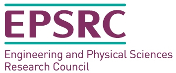
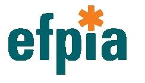
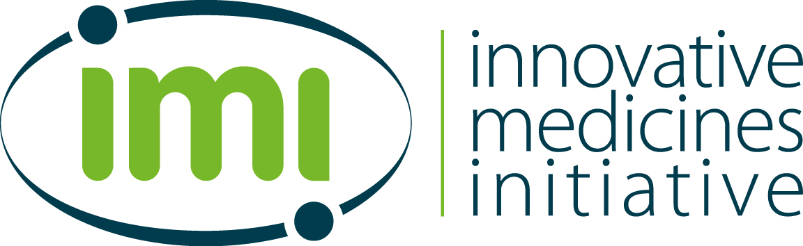

===========================================================
NiftyPET: High-throughput image reconstruction and analysis
===========================================================

.. image:: https://readthedocs.org/projects/niftypet/badge/?version=latest
  :target: https://niftypet.readthedocs.io/en/latest/?badge=latest
  :alt: Documentation Status

**Documentation**: https://niftypet.readthedocs.io/

|pic1| |pic2|

.. |pic1| image:: ./docs/images/gim_magna_t.gif
   :width: 45%

.. |pic2| image:: ./docs/images/gim_magna_c.gif
   :width: 45%

.. ::::::::::::::::::::::::::::::::::::::::::::::::::::::::::::::::::::::::::::::::::::::::::::::::::
.. taken from docs/highlights.rst

*NiftyPET* is a software platform and a Python namespace package encompassing sub-packages for high-throughput PET image reconstruction, manipulation, processing and analysis with high quantitative accuracy and precision.  See below for the description of the above image, reconstructed using *NiftyPET* [*]_.  

*NiftyPET* includes two packages:

  * ``nimpa``:  https://github.com/pjmark/NIMPA (neuro-image manipulation, processing and analysis)
  * ``nipet``:  https://github.com/pjmark/NIPET (quantitative PET neuro-image reconstruction)

The core routines are written in CUDA C and embedded in Python C extensions.  The scientific aspects of this software platform are covered in two open-access publications:

* *NiftyPET: a High-throughput Software Platform for High Quantitative Accuracy and Precision PET Imaging and Analysis* Neuroinformatics (2018) 16:95. https://doi.org/10.1007/s12021-017-9352-y

* *Rapid processing of PET list-mode data for efficient uncertainty estimation and data analysis* Physics in Medicine & Biology (2016). https://doi.org/10.1088/0031-9155/61/13/N322

Although, *NiftyPET* is dedicated to high-throughput image reconstruction and analysis of brain images, it can equally well be used for *whole body imaging*.  Strong emphasis is put on the data, which are acquired using positron emission tomography (PET) and magnetic resonance (MR), especially using the hybrid and simultaneous PET/MR scanners.  

This software platform covers the entire processing pipeline, from the raw list-mode (LM) PET data through to the final image statistic of interest (e.g., regional SUV), including LM bootstrapping and multiple independent reconstructions to facilitate voxel-wise estimation of uncertainties.

.. [*] The above dynamic transaxial and coronal images show the activity of  :sup:`18`\ F-florbetapir during the one-hour dynamic acquisition.  Note that the signal in the brain white matter dominates over the signal in the grey matter towards the end of the acquisition, which is a typical presentation of a negative amyloid beta (Abeta) scan.

.. ::::::::::::::::::::::::::::::::::::::::::::::::::::::::::::::::::::::::::::::::::::::::::::::::::

**Documentation with installation manual and tutorials**: https://niftypet.readthedocs.io/

**Acknowledgements**:  This project is being developed at University College London (`UCL <https://www.ucl.ac.uk/>`_). Initially, it was supported and funded by the Engineering and Physical Sciences Research Council (`EPSRC <https://epsrc.ukri.org/>`_) of the United Kingdom (UK).  Currently, the project is being further developed under the following funding streams:

1. The `Innovative Medicines Initiative 2 <https://www.imi.europa.eu/about-imi>`_ Joint Undertaking under grant agreement No 115952. This Joint Undertaking receives support from the European Union’s `Horizon 2020 <https://ec.europa.eu/programmes/horizon2020/en/>`_ research and innovation programme and `EFPIA <https://www.efpia.eu/>`_.

2. The `Dementias Platform UK <https://www.dementiasplatform.uk/>`_ `MR-PET Partnership <https://gtr.ukri.org/projects?ref=MR%2FN025792%2F1>`_, supported by the Medical Research Council (`MRC <https://mrc.ukri.org/>`_) in the UK.

We gratefully acknowledge the support of `NVIDIA Corporation <https://www.nvidia.com>`_  with the donation of the Tesla K20 and Titan X Pascal GPUs used for this research and work.

+---------+---------------------+
| |logo7| | |logo8|             |
+---------+-----------+---------+
| |logo4| +  |logo5|  + |logo6| |
+---------+-----------+---------+

|logo3|

.. |logo6| image:: ./docs/logos/EU-logo.png
   :align: middle
   :width: 94pt
   :height: 64pt
   :target: https://europa.eu/european-union/index_en

.. |logo8| image:: ./docs/logos/DPUK_logo.jpg
   :align: middle
   :width: 208pt
   :height: 64pt
   :target: https://www.dementiasplatform.uk/

Author and developer: Pawel J. Markiewicz @ University College London

Copyright 2018
