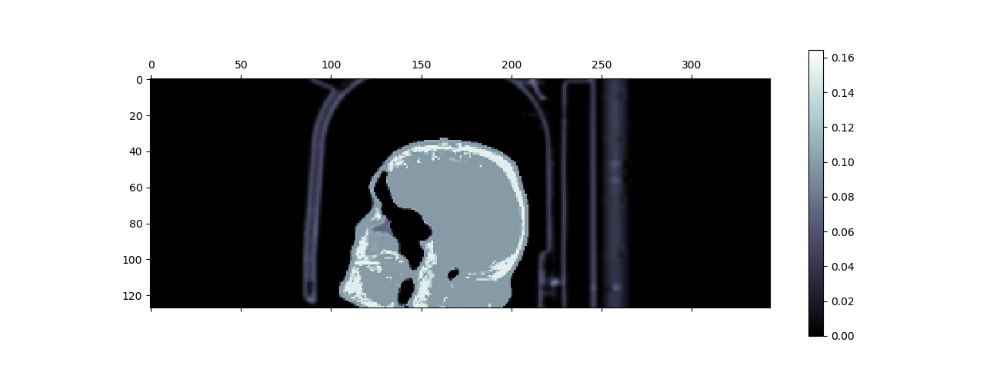
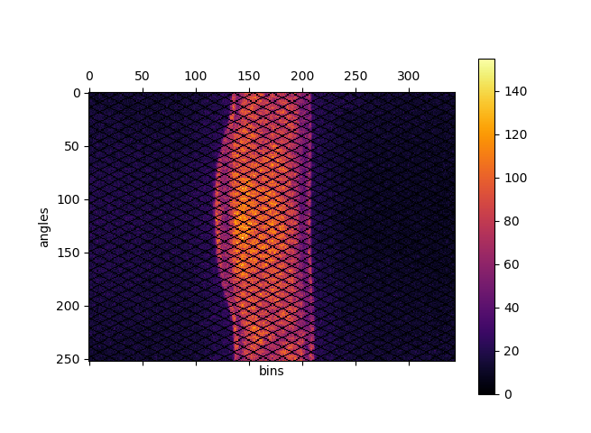
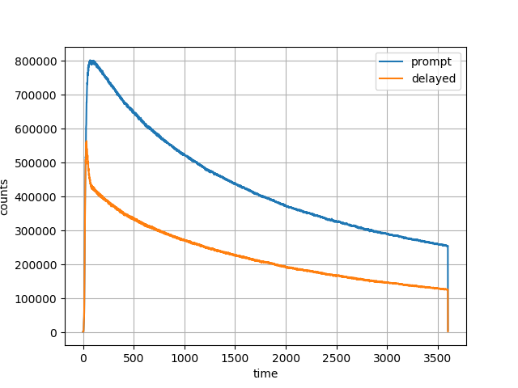

========
Tutorial
========

GPU device info in IPython
^^^^^^^^^^^^^^^^^^^^^^^^^^

`IPython <https://ipython.readthedocs.io/en/stable/index.html>`_ is an interactive Python prompt, particularly useful for PET/MR imaging.  Start IPython by issuing ``ipython`` in the terminal to obtain the following::

  Python 2.7.15 |Anaconda custom (64-bit)| (default, May  1 2018, 23:32:55) 
  Type "copyright", "credits" or "license" for more information.

  IPython 5.7.0 -- An enhanced Interactive Python.
  ?         -> Introduction and overview of IPython's features.
  %quickref -> Quick reference.
  help      -> Python's own help system.
  object?   -> Details about 'object', use 'object??' for extra details.

  In [1]: 

.. note:: At this stage Python 2.7 is supported.  Support for Python 3 is coming soon.

Import ``nimpa`` package from Python *NiftyPET* namespace and run the :

.. code-block:: python

  from niftypet import nimpa
  nimpa.gpuinfo()

which for two NVIDIA GPU devices used for this documentation (TITAN Xp and Quadro K4200) will produce::

  In [1]: from niftypet import nimpa
    ...:  nimpa.gpuinfo()
    ...: 
  Out[1]: [('TITAN X (Pascal)', 12788L, 6L, 1L), ('Quadro K4200', 4231L, 3L, 0L)]

  In [2]: 

Please note that only the first device is supported, i.e., the compute capability is ``>=3.5``::

  In [3]: nimpa.gpuinfo()[0][2:]
  Out[3]: (6L, 1L)

The same fuction is available in ``nipet``, i.e.:

.. code-block:: python

  from niftypet import nipet
  nipet.gpuinfo()

It's also possible to get extended information about the installed GPU devices by running either

.. code-block:: python

  nipet.gpuinfo(extended=True)

or

.. code-block:: python

  nimpa.gpuinfo(extended=True)

For the above GPU devices, the following will be obtained::
  
  In [4]: nimpa.gpuinfo(extended=True)
  i> there are 2 GPU devices.

  ----------------------------------------
  CUDA device: TITAN X (Pascal), ID = 0
  ----------------------------------------
  i> total memory [MB]:12788.50
  i> shared memory/block [kB]:   49.15
  i> registers (32bit)/thread block: 65536
  i> warp size: 32
  i> compute capability: 6.1
  i> clock rate [MHz]: 1531.00
  i> ECC enabled? 0
  i> max # threads/block: 1024

  i> Memory available: 12788.50[MB]
     Used: 504.37[MB] 
     Free:12284.13[MB]

  ----------------------------------------
  CUDA device: Quadro K4200, ID = 1
  ----------------------------------------
  i> total memory [MB]:4231.99
  i> shared memory/block [kB]:   49.15
  i> registers (32bit)/thread block: 65536
  i> warp size: 32
  i> compute capability: 3.0
  i> clock rate [MHz]:  784.00
  i> ECC enabled? 0
  i> max # threads/block: 1024

  i> Memory available: 4231.99[MB]
     Used:1117.06[MB] 
     Free:3114.93[MB]

  [('TITAN X (Pascal)', 12788L, 6L, 1L), ('Quadro K4200', 4231L, 3L, 0L)]
  Out[4]: [('TITAN X (Pascal)', 12788L, 6L, 1L), ('Quadro K4200', 4231L, 3L, 0L)]

Download amyloid brain PET data
^^^^^^^^^^^^^^^^^^^^^^^^^^^^^^^

The single scan raw amyloid PET data with all the necessary input components as mentioned above, can be obtain from research data repository **Zenodo** (click the DOI link to download the data):

  .. image:: https://zenodo.org/badge/DOI/10.5281/zenodo.1472951.svg
    :target: https://doi.org/10.5281/zenodo.1472951

The downloaded zip file contains a full dynamic list-mode PET data acquired on a `Siemens Biograph mMR <https://www.healthcare.siemens.co.uk/magnetic-resonance-imaging/mr-pet-scanner/biograph-mmr>`_ for 60 minutes, using amyloid tracer :sup:`18`\ F-florbetapir, provided by `Avid Radiopharmaceuticals, Inc., a wholly owned subsidiary of Lilly <https://investor.lilly.com/news-releases/news-release-details/lilly-joins-imaging-dementia-evidence-amyloid-scanning-ideas>`_.  The file also includes normalisation files and the :math:`\mu`-map based on MR Ultrashort TE (UTE) sequence :cite:`Robson2003,Keereman2010`, all three parts needed for an independent image reconstruction using NiftyPET.

Basic PET image reconstruction of PET amyloid scan
^^^^^^^^^^^^^^^^^^^^^^^^^^^^^^^^^^^^^^^^^^^^^^^^^^

For basic image reconstruction, *NiftyPET* requires:

  (1) PET list-mode data;
  (2) component-based normalisation file(s);
  (3) the :math:`\mu`-map image (the linear attenuation map as a 3D image).

which are provided in the above mentioned zip file.

Initialisation
--------------

Prior to dealing with the raw input data, required packages need to be imported and the Siemens Biograph mMR scanner constants and parameters (transaxial and axial lookup tables, LUTs) have to be loaded:

.. code-block:: python

  import numpy as np
  import sys, os

  # NiftyPET image reconstruction package (nipet)
  from niftypet import nipet
  # NiftyPET image manipulation and analysis (nimpa)
  from niftypet import nimpa

  # get all the scanner parameters
  mMRparams = nipet.get_mmrparams()

Sorting and classification data
--------------------------------

All the part of the input data is aimed to be automatically recognised in sorted in Python dictionary.  This can be obtained by providing a path to the folder with the unzipped above file with raw PET data in order to explore the input while storing the results in dictionary ``datain``:

.. code-block:: python
  
  # Enter the path to the input data folder
  folderin = '/path/to/input/data/folder/'

  # automatically categorise the input data
  datain = nipet.classify_input(folderin, mMRparams)

The output of datain for the above PET data should be as follows::

  In [5]: datain
  Out[5]: 
  {'#mumapDCM': 192,
   'corepath': '/data/amyloid_brain',
   'lm_bf': '/data/amyloid_brain/LM/17598013_1946_20150604155500.000000.bf',
   'lm_dcm': '/data/amyloid_brain/LM/17598013_1946_20150604155500.000000.dcm',
   'mumapDCM': '/data/amyloid_brain/umap',
   'nrm_bf': '/data/amyloid_brain/norm/17598013_1946_20150604082431.000000.bf',
   'nrm_dcm': '/data/amyloid_brain/norm/17598013_1946_20150604082431.000000.dcm'}

The parts of the recognised and categorised input data include:

==============  ==============
Type                  Path
==============  ==============
``corepath``    the core path of the input folder
``#mumapDCM``   the number of DICOM files for the :math:`\mu`-map, usually 192
``mumapDCM``    path to the MR-based DICOM  :math:`\mu`-map
``lm_bf``       path to the list-mode binary file
``lm_dcm``      the path to the DICOM header of the list-mode binary file
``nrm_bf``      path to the binary file for component based normalisation
``nrm_dcm``     path to the DICOM header for the normalisation
==============  ==============

.. note:: The raw mMR PET data can also be represented by a single ``*.ima`` DICOM file instead of the ``*.dcm`` and ``*.bf`` pairs for list-mode and normalisation data, which will be reflected in ``datain``.

Specifying output folder
------------------------

The path to the output folder where the products of *NiftyPET* go, as well as the ``verbose`` mode can be specified as follows: 

.. code-block:: python
  
  # output path
  opth = os.path.join( datain['corepath'], 'output')

  # switch on verbose mode
  mMRparams['Cnt']['VERBOSE'] = True

With the setting as above, the output folder ``output`` will be created within the input data folder.

Obtaining the hardware and object :math:`\mu`-maps
--------------------------------------------------

Since MR cannot image the scanner hardware, i.e., the patient table, head and neck coils, etc., the high resolution CT-based mu-maps are provided by the scanner manufacturer.  These then have to be appropriately resampled to the table and coils position as used in any given imaging setting.  The hardware and object :math:`\mu`-maps are obtained as follow:

.. code-block:: python

  # obtain the hardware mu-map (the bed and the head&neck coil)
  muhdct = nipet.hdw_mumap(datain, [1,2,4], mMRparams, outpath=opth, use_stored=True)

  # obtain the MR-based human mu-map
  muodct = nipet.obj_mumap(datain, mMRparams, outpath=opth, store=True)

The argument [1,2,4] for Obtaining the hardware :math:`\mu`-map correspond to the hardware bits used in imaging, i.e.:

  (1) Head and neck lower coil
  (2) Head and neck upper coil
  (3) Spine coil
  (4) Table

Currently, the different parts have to be entered manually (they are not automatically recognised which are in use).

The option ``use_stored=True`` allows to reuse the already created hardware :math:`\mu`-map, without recalculating it (the resampling can take more than a minute).

Both output dictionaries ``muhdct`` and ``muodct`` will contain images among other parameters, such as the image affine matrix and image file paths.

In order to check if both :math:`\mu`-maps were properly loaded, the maps can be plotted together transaxially by choosing the axial index ``iz`` along the :math:`z`-axis, as follows:

.. code-block:: python

  # axial index
  iz = 60

  # plot image with a colour bar
  matshow(muhdct['im'][iz,:,:] + muodct['im'][iz,:,:], cmap='bone')
  colorbar()

This will produce the following image:

.. figure:: images/mumap_tx.png
   :scale: 90 %
   :alt: transaxial composite of the mu-map

   Composite of the hardware and object :math:`\mu`-maps.  Observed can be the human head between the upper and lower head&neck coils, and the patient table below.

The sagittal image can be generated in a similar way, but choosing the slice along the :math:`x`-axis, i.e.:

.. code-block:: python

  # axial index
  ix = 170

  # plot image with a colour bar
  matshow(muhdct['im'][:,:,ix] + muodct['im'][:,:,ix], cmap='bone')
  colorbar()

   Sagittal view of the composite of the hardware and object :math:`\mu`-maps.  Observed can be the human head between the upper and lower head&neck coils, and the patient table on the right of the head.

List-mode processing with histogramming
---------------------------------------

The large list-mode is processed to obtain histogrammed data (sinograms) as well as other statistics on the acquisition, including the head curves and motion detection:

.. code-block:: python
  
  hst = nipet.mmrhist(datain, mMRparams)

The direct prompt and delayed sinograms can be viewed by choosing the sinogram index below 127 and from 127 up to 836 for oblique sinograms, i.e.:

.. code-block:: python
  
  # sinogram index (<127 for direct sinograms, >=127 for oblique sinograms)
  si = 60

  # prompt sinogram
  matshow(hst['psino'][si,:,:], cmap='inferno')
  colorbar()
  xlabel('bins')
  ylabel('angles')

  # delayed sinogram
  matshow(hst['dsino'][si,:,:], cmap='inferno')
  colorbar()
  xlabel('bins')
  ylabel('angles')

   Direct prompt sinogram for 60 minute amyloid PET acquisition.

.. figure:: images/dsino_60.png
   :scale: 100 %
   :alt: prompt sinogram

   Direct delayed sinogram for 60 minute PET acquisition.

The head-curve, which is the total number of counts detected per second across the acquisition time, for the prompt and delayed data can be plotted as follows:

.. code-block:: python

  plot(hst['phc'], label='prompt')
  plot(hst['dhc'], label='delayed')
  legend()
  grid('on')
  xlabel('time')
  ylabel('counts')

  Head curve for prompt and delayed events for the 60-minute acquisition.

In order to get general idea about the potential motion during the acquisition, the centre of mass of the radiodistribution along the axial direction can be plotted as follows:

.. code-block:: python
  
  plot(hst['cmass'])
  grid('on')
  xlabel('time')
  ylabel('Centre of mas of radiodistribution')

.. figure:: images/cmass.png
  :scale: 100 %
  :alt: centre of mass

  The centre of mass of the radiodistribution for the 60-minute amyloid PET acquisition.  Very little motion is observer--the smooth, exponentially varying curve is due to the tracer kinetics.

Image reconstruction
--------------------

The code below provides full image reconstruction for the last 10 minutes of the acquisition to get an estimate of the amyloid load through the ratio image (SUVr).

.. code-block:: python

  recon = nipet.mmrchain( 
      datain, mMRparams,
      frames = ['fluid', [3000, 3600]],
      mu_h = muhdct, 
      mu_o = muodct,
      itr=4,
      fwhm=0.0,
      outpath = opth,
      fcomment = 'niftypet-recon',
      store_img = True)

The input arguments are as follows:

==============  ============
argument        description
==============  ============
``datain``      input data (list-mode, normalisation and the :math:`\mu`-map) 
``mMRparams``   scanner parameters (scanner constants and LUTs)
``frames``      definitions of time frame(s);
``mu_h``        hardware :math:`\mu`-map
``mu_o``        object :math:`\mu`-map
``itr``         number of iterations of OSEM (14 subsets).
``fwhm``        full width at half-maximum for the image post-smoothing
``outpath``     path to the output folder
``fcomment``    prefix for all the generated output files
``store_img``   store images (yes/no)
==============  ============

- ``fluid`` indicates that the the start/stop is user-specified at any location.

The reconstructed image can be viewed as follow:

.. code-block:: python

  matshow(recon['im'][60,:,:], cmap='magma')
  colorbar()

.. figure:: images/recon_im.png
  :scale: 100 %
  :alt: centre of mass

  The transaxial slice of the amyloid PET reconstructed image.  Voxel intensities are in Bq.