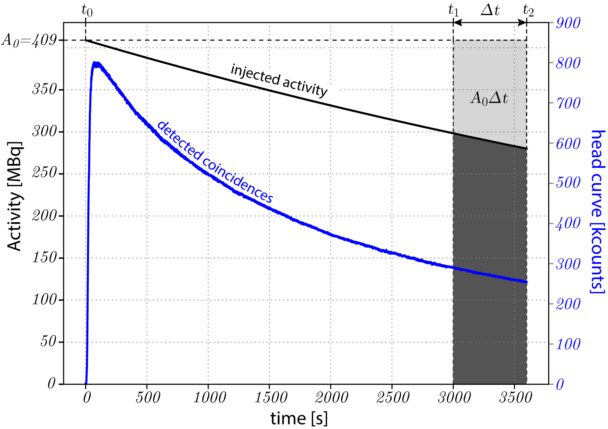

================================
Corrections for quantitative PET
================================

Decay correction
----------------

During any PET acquisition, the radio-tracer activity, :math:`A_t`, decays according to:

.. math::

   A_t = A_0e^{-\lambda t},

where :math:`A_0` is the reference activity at time :math:`t_0`. The decay constant :math:`\lambda` is defined as:

.. math::

   \lambda = \frac{\ln(2)}{T_{1/2}},

where :math:`T_{1/2}` is the half-life of the radionuclide.

Likewise, for activity :math:`A_t` at time :math:`t`, the original activity is simply:

.. math::

   A_0 = A_te^{\lambda t}.

Real PET acquisition example
^^^^^^^^^^^^^^^^^^^^^^^^^^^^

Consider the one-hour dynamic amyloid PET data provided in :ref:`data-section`. The injected radioactivity at :math:`t_0=0` was :math:`A_0 = 409` MBq, and since the used amyloid tracer is :sup:`18`\ F-based, the half life for the radioisotope is :math:`T_{1/2} = 6586.272` s (:math:`\approx 110` min), and hence :math:`\lambda = 1.052\times 10^{-4}` s\ :sup:`-1`.  The radioactive decay from the injected activity is shown in black in :numref:`fig-decay`.

Consider also a time frame of the last 10 minutes of acquisition, from :math:`t_1=3000` to :math:`t_2 = 3500` seconds, as shown in :numref:`fig-decay`.  In order to correct for the decay not only within the time frame, but also relative to the beginning of the scan at injection, the measurable activity of the time frame needs to be compared to the ideal case of no radioactive decay.

.. _fig-decay:

   Radioactive decay, shown in black, from the injected activity of :math:`A_0=409` MBq. The recorded prompt events are shown in blue.  The decay correction calculations are shown for a frame of the last 10 minutes of acquisition.  **Please note** that the injected activity is significantly greater than the recorded events (coincidences) as the field of view of the scanner allows only part of the body to be scanned. **Note** also the significantly different distribution of the detected coincidences, which is decaying considerably faster than the injected activity, and which is due to tracer clearance from the participant's head, dead-time and other factors.

In this example, the ideal radioactivity would remain constant at :math:`A_0 = 409` MBq, as is shown by the horizontal dashed line.  Therefore, for the considered duration of the time frame, the measurable ideal activity would be :math:`A_0\Delta t`.

In the real case scenario, however, the activity decays, and the measurable activity with the time frame is:

.. math::

   \int_{t_1}^{t_2} A_0e^{-\lambda t} \mathrm{d}t & = -\tfrac{1}{\lambda} e^{-\lambda t} \Big|_{t_1}^{t_2}

   & = \frac{A_0}{\lambda}\big(e^{-\lambda t_1} - e^{-\lambda t_2}\big)
  

The decay correction, :math:`C_{\textrm{decay}}^{t_0}`, for the time frame relative to the beginning of scan (injection), :math:`t_0=0`, is simply the ratio of the two activities, i.e., the ideal one to the decaying, :math:`\Delta t`, of the frame:

.. math::
  
   C_{\textrm{decay}}^{t_0} & = \frac{A_0\Delta t }{A_0 (e^{-\lambda t_1} -  e^{-\lambda t_2}) / \lambda }

   & = \frac{\lambda \Delta t}{e^{-\lambda t_1} (1 - e^{-\lambda \Delta t}) },

and finally obtaining:

.. math::

   C_{\textrm{decay}}^{t_0} = \frac{\lambda e^{\lambda t_1} \Delta t }{1 - e^{-\lambda \Delta t}}.

   
See also http://www.turkupetcentre.net/petanalysis/decay.html.

Controlling decay correction in *NiftyPET*
^^^^^^^^^^^^^^^^^^^^^^^^^^^^^^^^^^^^^^^^^^

The decay correction is by default applied automatically with the reference to the beginning of scan as recorded in the list-mode data.  It does not need to be the injection time, i.e., in case of static scans, when the patient waits a time post-injection before is scanned.  In *NiftyPET* decay correction is controlled by the dictionary entry ``Cnt['DCYCRR']``.  For example, if the scanner is initialised as follows:

.. code-block:: python

  # NiftyPET image reconstruction package (nipet)
  from niftypet import nipet
  # NiftyPET image manipulation and analysis (nimpa)
  from niftypet import nimpa

  # get all the Biograph mMR parameters
  mMRpars = nipet.get_mmrparams()

Then the default decay correction can be switched off, if the following line:

.. code-block:: python
   
   mMRpars['Cnt']['DCYCRR'] = False,
   
is placed before image reconstruction.  By default ``mMRpars['Cnt']['DCYCRR'] = True``.
