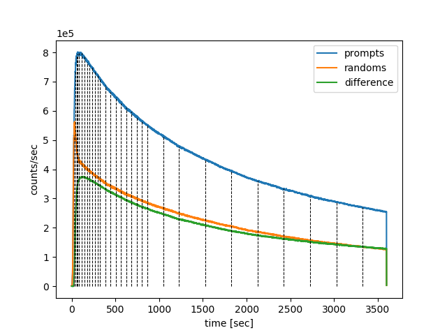
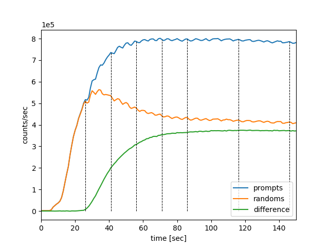

===============================
Dynamic image reconstruction
===============================

Dynamic imaging involves reconstruction of a series of static images across the whole duration of the acquisition time (usually not less than one hour) by dividing the time into usually non-overlapping dynamic time frames.  It is assumed that the average tracer concentration during any frame is representative of the whole frame and any concentration changes within the frame are considered minor relative to the changes across the whole acquisition.

Dynamic reconstruction of the Biograph mMR data uses the same function, ``nipet.mmrchain`` as shown in section :ref:`statrec-subsection` for the mMR chain processing.  In addition to the basic parameters used, additional parameters need to be defined for dynamic reconstruction.

.. _dynfrms-subsection:

Dynamic time frame definitions
------------------------------

The extra parameters include the definition of the dynamic time frames.  For example, for identical acquisitions, as the provided amyloid PET data (see :ref:`data-section`), the one-hour dynamic PET data was divided into 31 dynamic frames in :cite:`Scott2018`, i.e.: 4 |times| 15s, 8 |times| 30s, 9 |times| 60s, 2 |times| 180s, 8 |times| 300s, which makes the total of 3600s (one hour).

.. |times| unicode:: 0x0D7 .. unicode for \times  

These definitions can then be represented using Python lists in three ways:

   #. the simplest way---a 1-D list, with elements representing the consecutive frame durations in seconds, i.e., for the above definitions it will be:

      .. code-block:: python

         frmdef_1D = [ 
            15,  15,  15,  15,
            30,  30,  30,  30, 
            30,  30,  30,  30,
            60,  60,  60,
            60,  60,  60,
            60,  60,  60,
            180, 180,
            300, 300, 300, 300,
            300, 300, 300, 300
            ]

   #. a more elegant representation is by using a 2-D Python list, starting with a string 'def', followed by two-element sub-lists with the repetition number and the duration in seconds [s], respectively, i.e.:

      .. code-block:: python

         frmdef_2D = ['def', [4, 15], [8, 30], [9, 60], [2, 180], [8, 300]]

   #. and the last most flexible representation is by using again a 2-D list, starting with a string 'timings' or 'fluid', followed by two-element sub-lists with the start time, :math:`t_0` and the end time :math:`t_1` for each frame, i.e.:

      .. code-block:: python

         frmdef_t = [
                  'timings',
                  [0, 15],
                  [15, 30],
                  [30, 45],
                  [45, 60],
                  [60, 90],
                  [90, 120],
                  [120, 150],
                  [150, 180],
                  [180, 210],
                  [210, 240],
                  [240, 270],
                  [270, 300],
                  [300, 360],
                  [360, 420],
                  [420, 480],
                  [480, 540],
                  [540, 600],
                  [600, 660],
                  [660, 720],
                  [720, 780],
                  [780, 840],
                  [840, 1020],
                  [1020, 1200],
                  [1200, 1500],
                  [1500, 1800],
                  [1800, 2100],
                  [2100, 2400],
                  [2400, 2700],
                  [2700, 3000],
                  [3000, 3300],
                  [3300, 3600]
                  ]

The last representation is the most flexible as it allows the time frames to be defined independent of each other.  This is especially useful when defining overlapping time frames or frames which are not necessarily consecutive time-wise.

All the definitions can be summarised in one dictionary using the above ``frmdef_1D`` or ``frmdef_2D`` definitions, i.e.:

   .. code-block:: python

      # import the NiftyPET sub-package if it is not loaded yet
      from niftypet import nipet

      # frame dictionary
      frmdct = nipet.dynamic_timings(frmdef_1D)

or

   .. code-block:: python

      # frame dictionary
      frmdct = nipet.dynamic_timings(frmdef_2D)

resulting in:

   .. code-block:: python

      In [1]: frmdct
      Out[1]: 
      {'frames': array([ 15,  15,  15,  15,  30,  30,  30,  30,  30,  30,  30,  30,  60,
               60,  60,  60,  60,  60,  60,  60,  60, 180, 180, 300, 300, 300,
              300, 300, 300, 300, 300], dtype=uint16),
       'timings': ['timings',
        [0, 15],
        [15, 30],
        [30, 45],
        [45, 60],
        [60, 90],
        [90, 120],
        [120, 150],
        [150, 180],
        [180, 210],
        [210, 240],
        [240, 270],
        [270, 300],
        [300, 360],
        [360, 420],
        [420, 480],
        [480, 540],
        [540, 600],
        [600, 660],
        [660, 720],
        [720, 780],
        [780, 840],
        [840, 1020],
        [1020, 1200],
        [1200, 1500],
        [1500, 1800],
        [1800, 2100],
        [2100, 2400],
        [2400, 2700],
        [2700, 3000],
        [3000, 3300],
        [3300, 3600]],
       'total': 3600}

Please note, that internally, consecutive dynamic frames are represented as an array of unsigned 16-bit integers.

Dynamic reconstruction
----------------------

The dynamic reconstruction can be invoked after the following setting-up and pre-processing:

   .. code-block:: python

      import os
      from niftypet import nipet
      from niftypet import nimpa

      # dynamic frames for kinetic analysis
      frmdef = ['def', [4, 15], [8, 30], [9, 60], [2, 180], [8, 300]]

      # get all the constants and LUTs
      mMRpars = nipet.get_mmrparams()

      #------------------------------------------------------
      # GET THE INPUT
      folderin = '/path/to/amyloid_brain'

      # recognise the input data as much as possible
      datain = nipet.classify_input(folderin, mMRpars)
      #------------------------------------------------------

      # switch on verbose mode
      mMRpars['Cnt']['VERBOSE']=True

      # output path
      opth = os.path.join( datain['corepath'], 'output')

      #------------------------------------------------------
      # GET THE MU-MAPS
      muhdct = nipet.hdw_mumap(datain, [1,2,4], mMRpars, outpath=opth, use_stored=True)

      # UTE-based object mu-map
      muodct = nipet.obj_mumap(datain, mMRpars, outpath=opth, store=True)
      #-----------------------------------------------------

Since multiple image frames are reconstructed, the ``mmrchain`` function apart from 4-D NIfTI image storing, also enables to store intermediate 3-D NIfTI images for each dynamic frame using the option ``store_img_intrmd = True``:

   .. code-block:: python

      recon = nipet.mmrchain( 
               datain,
               mMRpars,
               frames = frmdef,
               mu_h = muhdct, 
               mu_o = muodct,
               itr = 4,
               fwhm = 0.,
               outpath = opth,
               fcomment = '_dyn',
               store_img = True,
               store_img_intrmd = True)

The path to the reconstructed 4-D image can be accessed through the output dictionary, ``recon``:

   .. code-block:: python

      In [2]: recon['im'].shape
      Out[2]: (31, 127, 344, 344)

or the stored 4-D NIfTI image in:

   .. code-block:: python

      In [19]: recon['fpet']
      Out[19]: '/path/to/NIfTI-output'

Time offset due to injection delay
----------------------------------

In most cases the injection is performed with some delay relative to the time of starting the scan.  Also, the first recorded counts will be random events, as the activity is detected from outside the field of view (FOV). The offset caused by the injection delay and random events, can be separated and omitted by running first list mode processing with histogramming, followed by estimating the time offset and accounting for it in the timings of the frames:

   .. code-block:: python

      # histogram the list mode data (in datain dictionary) using scanner parameters (MMRpars)
      hst = nipet.mmrhist(datain, mMRpars)

      # offset for the time from which meaningful events are detected
      toff = nipet.lm.get_time_offset(hst)

      # dynamic frame timings
      frm_timings = nipet.lm.dynamic_timings(frmdef, offset=toff)

The reconstruction is then performed with the augmented timings in the following way:

   .. code-block:: python

      recon = nipet.mmrchain( 
               datain,
               mMRpars,
               frames = frm_timings,
               mu_h = muhdct, 
               mu_o = muodct,
               itr = 4,
               fwhm = 0.,
               outpath = opth,
               fcomment = '_dyn',
               store_img = True,
               store_img_intrmd = True)

Note, that the reconstruction pipeline accepts different definitions of the dynamic frames as shown above.

Visualisation of dynamic frame timings
--------------------------------------

The time frames can be visualised with one line of code:

   .. code-block:: python

      # draw the frame timings over the head-curve
      nipet.lm.draw_frames(hst, frm_timings)

which plots the timings of dynamic frames over the prompts, delayeds and the difference between the two as shown below in :numref:`fig-toff`.

.. _fig-toff:

   The dynamic frame intervals are marked with dashed horizontal black curves on top of the head-curve (prompts and delayeds per second).

In order to zoom in to a particular time interval, e.g., from 0s to 150s, and visualise clearly the time offset, the following line of code can be used:

   .. code-block:: python

      # draw the frame timings over the head-curve, with time limits of tlim
      nipet.lm.draw_frames(hst, frm_timings, tlim = [0, 150])

resulting in the following plot (:numref:`_fig-toff-zoom`):

.. _fig-toff-zoom:

   The dynamic frame intervals are marked with dashed horizontal black curves on top of the part of head-curve (prompts and delayeds per second).  Note that almost 30s of list mode data from the beginning is discarded.