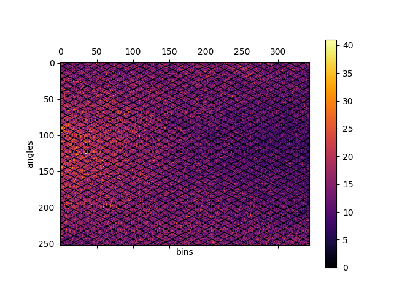
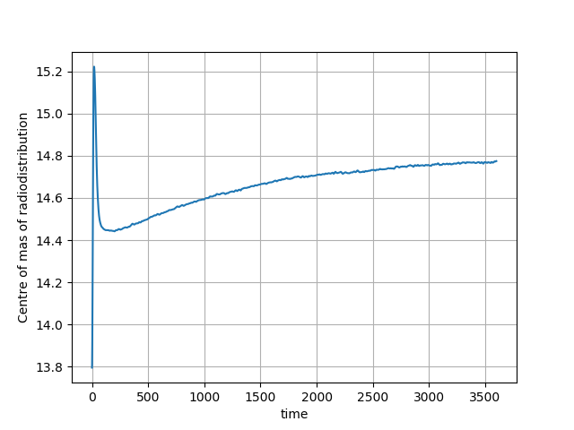

==========================
List-mode processing and motion detection
==========================

The list-mode (LM) data is usually of large size in the order of GB.  In NiftyPET, the LM data is hidden within image reconstruction function (see :ref:`_basic-recon-section`) and processed automatically.  However, the LM data can be processed separately to obtain histogrammed data (sinograms) as well as other statistics of the PET acquisition, including the head curves and motion detection.  

After the following initialisation and input data specification (an example of amyloid brain acquisition is provided at :ref:`data-section` :cite:`Markiewicz2018c`): 

.. code-block:: python

  import sys, os, logging
  from niftypet import nipet
 
  # control the logging output
  logging.basicConfig(level=logging.INFO)
  
  # get all the scanner parameters (mMR)
  mMRpars = nipet.get_mmrparams()

  # Enter the path to the input data folder
  folderin = '/path/to/input/data/folder/'

  # automatically categorise the input data
  datain = nipet.classify_input(folderin, mMRpars)

the LM data processing can be performed by running the following line:

.. code-block:: python

  hst = nipet.mmrhist(datain, mMRpars)

The direct prompt and delayed sinograms can be viewed by choosing the sinogram index below 127 and from 127 up to 836 for oblique sinograms, i.e.:

.. code-block:: python

  # sinogram index (<127 for direct sinograms, >=127 for oblique sinograms)
  si = 60

  # prompt sinogram
  matshow(hst['psino'][si,:,:], cmap='inferno')
  colorbar()
  xlabel('bins')
  ylabel('angles')

  # delayed sinogram
  matshow(hst['dsino'][si,:,:], cmap='inferno')
  colorbar()
  xlabel('bins')
  ylabel('angles')

.. figure:: images/psino_60.png
   :scale: 100 %
   :alt: prompt sinogram

   Direct prompt sinogram for 60 minute amyloid PET acquisition.

   Direct delayed sinogram for 60 minute PET acquisition.

The head-curve, which is the total number of counts detected per second across the acquisition time, for the prompt and delayed data can be plotted as follows:

.. code-block:: python

  plot(hst['phc'], label='prompt')
  plot(hst['dhc'], label='delayed')
  legend()
  grid('on')
  xlabel('time')
  ylabel('counts')

.. figure:: images/HC.png
  :scale: 100 %
  :alt: head curve

  Head curve for prompt and delayed events for the 60-minute acquisition.

Motion detection
----------------

In order to get a general idea about the potential motion during the acquisition, the LM processing includes the centre of mass of the radiodistribution along the axial direction as one of the main directions of motion.  This centre of mass information can be plotted as follows for the available dataset (:ref:`data-section`):

.. code-block:: python

  plot(hst['cmass'])
  grid('on')
  xlabel('time')
  ylabel('Centre of mas of radiodistribution')

which for the provided one-hour amyloid acquisition will produce:

  The centre of mass of the radiodistribution for the 60-minute amyloid PET acquisition.  Very little motion is observer--the smooth, exponentially varying curve is due to the tracer kinetics.

For another amyloid acquisition with motion, the curve can look like this:

.. figure:: images/cmass-mo.png
  :scale: 100 %
  :alt: centre of mass for case with motion

  The centre of mass of the radiodistribution for another 60-minute amyloid PET acquisition in which motion occurred.  The motion is observer by the 'breaks', in particular seen around 1760 second (the 29th minute) of the curve on top of the smooth exponential due to the tracer pharmacokinetics.